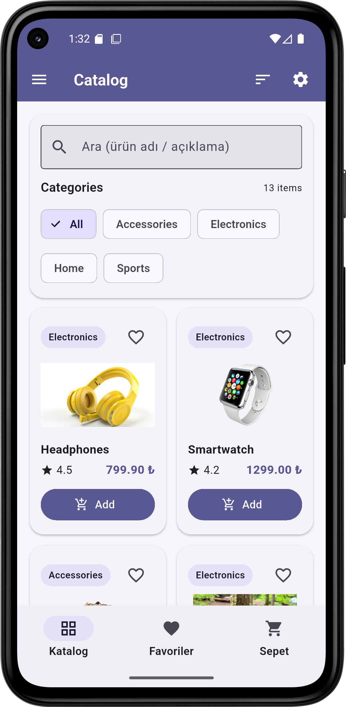
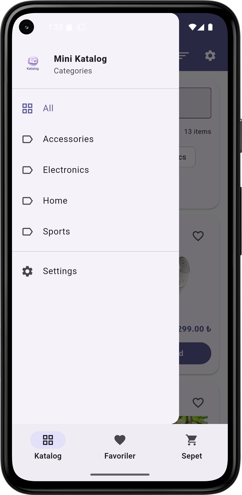
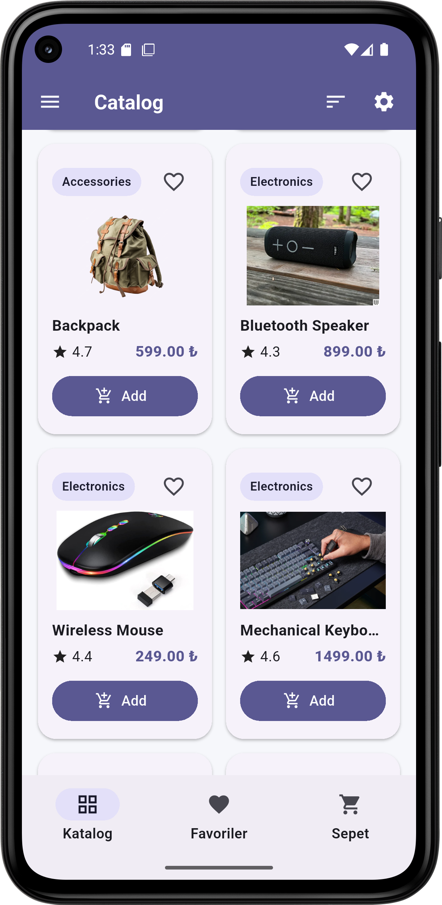
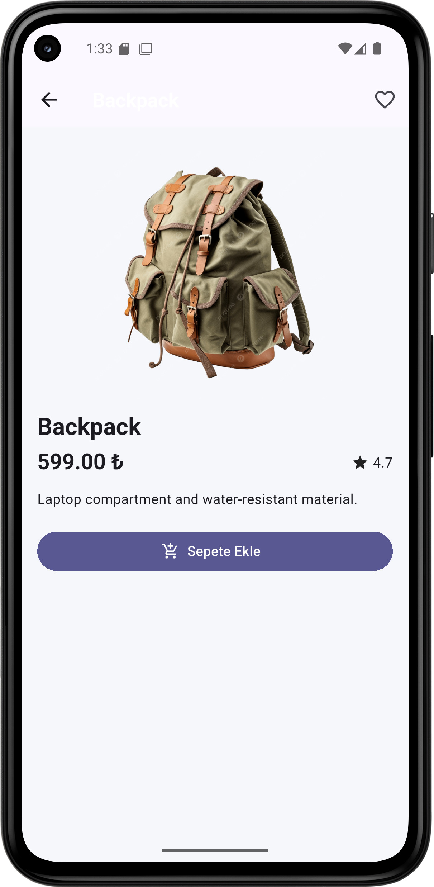

# Mini Katalog — Flutter Catalog App

[](https://flutter.dev/)
[](https://dart.dev/)
[](#)

Mini Katalog is a Flutter-based mobile application for managing and displaying a simple product catalog.  
It showcases clean UI design with Material components, basic state management, and a clear project structure.

---

## ✨ Features

- Browse a product list
- Add new catalog items
- Edit and manage existing items
- Responsive, clean UI (Material Design)
- Fast and lightweight performance

---

## 🛠 Tech Stack

- **Flutter**
- **Dart**
- **Material Design**

Tested with an **Android Emulator**.

---

## 📁 Project Structure

```text
lib/
├── main.dart
├── models/
├── screens/
└── widgets/
```

---

## 🚀 Getting Started

### Prerequisites
- Flutter SDK installed (and added to PATH)
- A device or emulator (Android/iOS) — or Chrome for web

### Installation

1. Clone the repository:
```bash
git clone https://github.com/sinaares/mini_katalog.git
```

2. Navigate to the project folder:
```bash
cd mini_katalog
```

3. Install dependencies:
```bash
flutter pub get
```

4. Run the app:
```bash
flutter run
```

---

## 🖼 Screenshots

<p align="center">
  
  
  
  
</p>

---

## 🎯 Purpose

This project was created for academic/internship practice to strengthen Flutter development skills and improve understanding of mobile UI/UX design principles.

---

## 👤 Author

**Sina Hashemi**  
GitHub: https://github.com/sinaares

---

## 📄 License

This repository is open-source and intended for educational use.

> Recommended: add a `LICENSE` file (MIT is common) and update this section accordingly.
